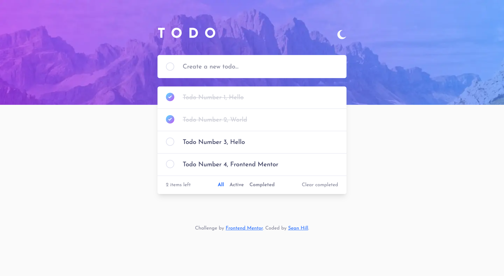

# Frontend Mentor - Todo app solution

This is a solution to the [Todo app challenge on Frontend Mentor](https://www.frontendmentor.io/challenges/todo-app-Su1_KokOW). Frontend Mentor challenges help you improve your coding skills by building realistic projects. 

## Table of contents

- [Overview](#overview)
  - [The challenge](#the-challenge)
  - [Screenshot](#screenshot)
  - [Links](#links)
- [My process](#my-process)
  - [Built with](#built-with)
  - [What I learned](#what-i-learned)
  - [Continued development](#continued-development)
  - [Useful resources](#useful-resources)
- [Author](#author)

**Note: Delete this note and update the table of contents based on what sections you keep.**

## Overview

### The challenge

Users should be able to:

- View the optimal layout for the app depending on their device's screen size
- See hover states for all interactive elements on the page
- Add new todos to the list
- Mark todos as complete
- Delete todos from the list
- Filter by all/active/complete todos
- Clear all completed todos
- Toggle light and dark mode
- **Bonus**: Drag and drop to reorder items on the list

### Screenshot



### Links

- Solution URL: [View on Netlify](https://fem-todo-app-seanhillweb.netlify.app/)
- Project URL: [View on Github](https://github.com/seanhillweb/frontend-mentor-todo-app)

## My process

### Built with

- [React](https://reactjs.org/)
- [React Hook Forms](https://www.react-hook-form.com/)
- [Next.js](https://nextjs.org/)
- [Tailwind CSS](https://tailwindcss.com/)
- [Next Themes](https://github.com/pacocoursey/next-themes)

### What I learned

How to use a Reducer within a React project. I've had some exposure to this pattern before, but this was the perfect opportunity to dig into it a little further. I think I came away with a sold understanding, and clear structure.

My reducer actions:

```js
export const ACTIONS = {
  ADD_TODO: "ADD_TODO",
  DELETE_TODO: "DELETE_TODO",
  TOGGLE_TODO: "TOGGLE_TODO",
  CLEAR_COMPLETE: "CLEAR_COMPLETE",
  SHOW_ALL_TODOS: "SHOW_ALL_TODOS",
  SHOW_ACTIVE_TODOS: "SHOW_ACTIVE_TODOS",
  SHOW_COMPLETE_TODOS: "SHOW_COMPLETE_TODOS",
};

export function AppReducer(state, action) {
  switch (action.type) {
    case ACTIONS.ADD_TODO:
      return {
        ...state,
        todos: [...state.todos, action.payload],
      };
    case ACTIONS.DELETE_TODO:
      return {
        ...state,
        todos: state.todos.filter(
          (item) => item.id !== action.payload
        ),
        activeTodos: state.activeTodos.filter(
          (item) => item.id !== action.payload
        ),
        completeTodos: state.completeTodos.filter(
          (item) => item.id !== action.payload
        ),
      };
    case ACTIONS.TOGGLE_TODO:
      return {
        ...state,
        todos: state.todos.map((item) => {
          if (item.id === action.payload) {
            return { ...item, completed: !item.completed };
          }
          return item;
        }),
        activeTodos: state.activeTodos.map((item) => {
          if (item.id === action.payload) {
            return { ...item, completed: !item.completed };
          }
          return item;
        }),
        completeTodos: state.completeTodos.map((item) => {
          if (item.id === action.payload) {
            return { ...item, completed: !item.completed };
          }
          return item;
        }),
      };
    case ACTIONS.CLEAR_COMPLETE:
      return {
        ...state,
        todos: state.todos.filter((item) => item.completed === false),
        completeTodos: []
      };
    case ACTIONS.SHOW_ALL_TODOS:
      return {
        ...state,
        showTodos: true,
        showActiveTodos: false,
        showCompleteTodos: false,
      };
    case ACTIONS.SHOW_ACTIVE_TODOS:
      return {
        ...state,
        activeTodos: [
          ...state.todos.filter((item) => item.completed === false),
        ],
        showTodos: false,
        showActiveTodos: true,
        showCompleteTodos: false,
      };
    case ACTIONS.SHOW_COMPLETE_TODOS:
      return {
        ...state,
        completeTodos: [
          ...state.todos.filter((item) => item.completed === true),
        ],
        showTodos: false,
        showActiveTodos: false,
        showCompleteTodos: true,
      };
    default:
      return state;
  }
}
```

How I setup the context within the application:

```js
"use client";

import React, { createContext, useReducer, useContext } from "react";
import { ACTIONS, AppReducer } from "@/context/reducer";

export const AppContext = createContext();

export function AppContextProvider({ children }) {

  const initialState = {
    todos: [],
    activeTodos: [],
    completeTodos: [],
    showTodos: true,
    showActiveTodos: false,
    showCompleteTodos: false,
  };

  const [state, dispatch] = useReducer(AppReducer, initialState);

  const addTodo = (object) => {
    dispatch({ type: ACTIONS.ADD_TODO, payload: object });
  };

  const deleteTodo = (id) => {
    dispatch({ type: ACTIONS.DELETE_TODO, payload: id });
  };

  const toggleTodo = (id) => {
    dispatch({ type: ACTIONS.TOGGLE_TODO, payload: id });
  };

  const clearTodos = () => {
    dispatch({ type: ACTIONS.CLEAR_COMPLETE });
  };

  const showAllTodos = () => {
    dispatch({ type: ACTIONS.SHOW_ALL_TODOS });
  };

  const showActiveTodos = () => {
    dispatch({ type: ACTIONS.SHOW_ACTIVE_TODOS });
  };

  const showCompleteTodos = () => {
    dispatch({ type: ACTIONS.SHOW_COMPLETE_TODOS });
  };

  return (
    <AppContext.Provider
      value={{
        state,
        addTodo,
        deleteTodo,
        toggleTodo,
        clearTodos,
        showAllTodos,
        showActiveTodos,
        showCompleteTodos
      }}
    >
      {children}
    </AppContext.Provider>
  );
}

export function useAppContext() {
  return useContext(AppContext);
}
```

### Continued development

Something I would be interested in furthing develop would be the drag and drop interface. I already implemented a lot of new patterns with the project, and I thought that would be overload. A tool that I'm interested in using would be:

- [React DnD](https://react-dnd.github.io/react-dnd/about)

Has anyone with the Frontend Mentor community used this tool? What would it take to integrate into this project?

### Useful resources

- [React useReducer Example](https://www.youtube.com/watch?v=kK_Wqx3RnHk&t=901s) - This video helped the inform the initial structure of the project. Easy to follow.
- [Working Example by Elisabeth Leonhardt](https://www.elisabethleonhardt.com/projects/todo-app) - More often than not, finding similar projects can reveal avenues for solutions you wouldn't initally think of!
- [Working Example by Andrei Ion](https://www.youtube.com/watch?v=9ew82H6U-n4&t=1016s) - Other example that provided a lot of guidence towards building this app.

## Author

- Website - [Sean Hill](https://www.seanhillweb.com)
- Frontend Mentor - [@seanhillweb](https://www.frontendmentor.io/profile/seanhillweb)
